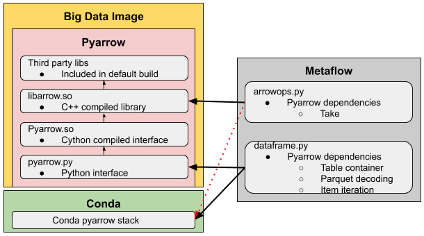

## Introduction

Metaflow-data is a C/C++ library that serves as the backend for Fast Data tools
in [Metaflow](https://manuals.netflix.net/view/mli/mkdocs/master/). This
project aims to create a single self-contained shared object that contains all
Fast Data dependencies.

### Context

Fast Data has traditionally relied on the Apache Arrow python
bindings([PyArrow](https://arrow.apache.org/docs/python/index.html) for
functionality such as parquet decoding. Some additional functionality was built
in C++/Cython on top of the shared libraries shipped with PyArrow. Surrounding
environments (e.g. platform base docker images) and other ML softwares are
increasingly depending on PyArrow (often specific versions). Together, this
creates a complex set of dependency that are difficult to maintain and
coordinate and cause disruption in production system. Metaflow-data aims to
provide an isolated Fast Data layer for Metaflow that is independent of its
enviornment, can share data with other systems using Arrow memory, and is
dependency free.

See [this
document](https://docs.google.com/document/d/10SOC2BHuaNlCzL-3SKbckrbPn8j5IYMCPs0H0BnZKwU/edit#heading=h.2eixr4j1tuik)
that goes deeper into the motivation for Metaflow-data

## Links
- [Design](https://stash.corp.netflix.com/projects/MLI/repos/metaflow-data/browse/docs/design.md
