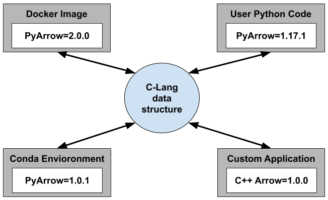
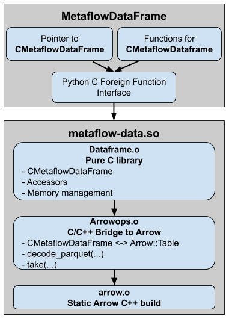
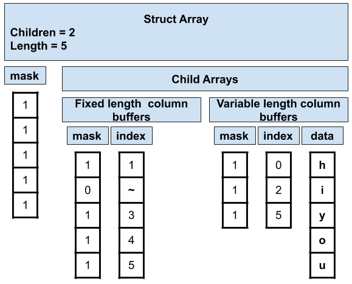
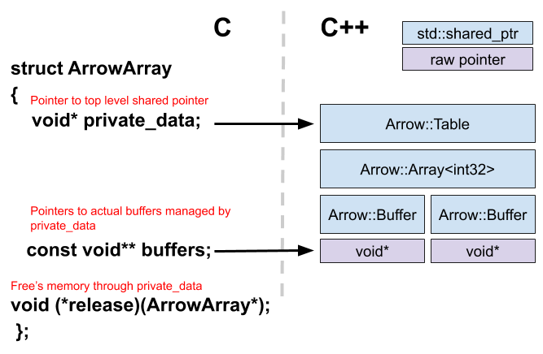
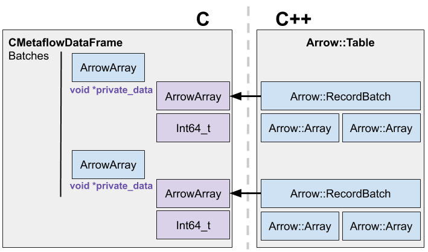

## High-level Architecture

### Arrow C-lang exchange format


### Metaflow-data.so


## Core Data Structures


### Arrow Structures

ArrowSChema's hold information about arrow arrays.

```
struct ArrowSchema {
  const char* format;
  const char* name;
  const char* metadata;
  int64_t flags;
  int64_t n_children;
  struct ArrowSchema** children;
  struct ArrowSchema* dictionary;

  void (*release)(struct ArrowSchema*);
  void* private_data;
};
```

ArrowArray's hold buffers of data.

```
struct ArrowArray {
  // Array data description
  int64_t length;
  int64_t null_count;
  int64_t offset;
  int64_t n_buffers;
  int64_t n_children;
  const void** buffers;
  struct ArrowArray** children;
  struct ArrowArray* dictionary;

  void (*release)(struct ArrowArray*);
  void* private_data;
};
```

CMetaflowDataFrame's hold batches of arrow struct arrays

### CMetaflowDataFrame
```
struct CMetaflowDataFrame {
    struct ArrowArray** batches;
    struct ArrowSchema* schema;
    int64_t n_batches;
    int64_t n_rows;
};
```

### Reference counted Shared Pointer Structures

A CMetaflowDataFrame's ArrowSChema's and ArrowArray's hold a pointer to a these
shared objects in the private_data field.

```
struct SharedArrowSchema {
    struct ArrowSchema schema;
    int64_t count;
};
```

```
struct SharedArrowArray {
    struct ArrowArray array;
    int64_t count;
};
```

## Memory management

### Arrow exchange



### CMetaflowDataFrame reference counting


